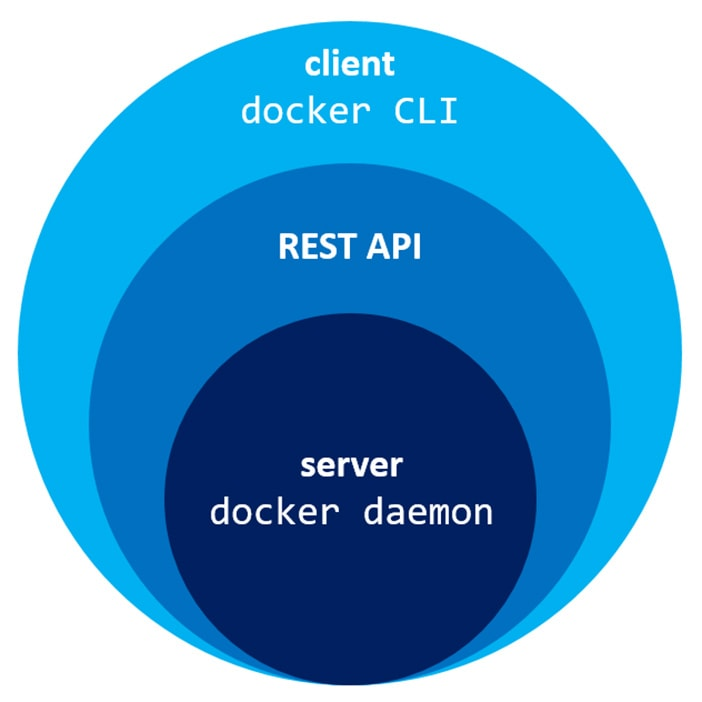
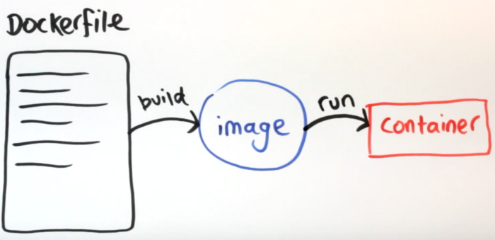

<!-- A ordem dos conteúdos listados abaixo podem mudar -->

# Docker `r emo::ji("whale")`
<!-- Explicar o docker daemon aqui também -->

<!-- Existing Tools for Reproducible Research in Science Docker -->
O Docker é uma plataforma que usa o Linux Containers (LXC) para encapsular completamente aplicativos de software. É um projeto de código aberto apoiado por uma empresa privada que tem se concentrado no desenvolvimento do Docker como uma plataforma para hospedagem de aplicativos web fácil e escalável.

O LXC é uma tecnologia de virtualização em nível de sistema operacional que cria um ambiente virtual totalmente em área restrita no Linux sem a sobrecarga de uma máquina virtual completa. O Docker estende a tecnologia LXC, facilita o uso e fornece versões, distribuição e implantação fáceis. A sobrecarga de um contêiner do Docker é muito menor que uma máquina virtual tradicional porque não replica o sistema operacional completo, apenas as bibliotecas e binários do aplicativo sendo virtualizados.

Um contêiner Docker é executado em um ambiente totalmente virtualizado, portanto, um algoritmo pode ser executado usando qualquer linguagem compatível com Linux (R, Python, C, Matlab, etc.) e ser compilado usando qualquer biblioteca compatível com Linux sem causar conflitos de versão ou biblioteca com outros algoritmos. Além disso, um contêiner Docker pode ser exportado e arquivado e executado a qualquer momento no futuro, com a confiança de que o ambiente computacional será idêntico, supondo que o projeto Docker permaneça compatível com versões anteriores.
<!-- ------------------------- -->

Docker é uma aplicação cliente-servidor, ou seja, toda sua comunicação é baseada em troca de dados através de algum protocolo entre um cliente e o serviço docker que está alocado no servidor. <!-- Acho que a explicação do docker daemon deve vir aqui! -->



<!-- Fazer uma versão mais simples dessa imagem -->
<!--  -->

<!-- Docker é formado por três componentes principais (@Chung2016) Docker images, registry e containers [...].  -->

<!-- Explicar aqui o que é o docker -->
<!-- Falar das versões que estão disponíveis (Linux, MacOS e Windows). Deixar claro que a recomendação de uso é no Linux -->
<!-- Ao falar sobre a causa da recomendação da utilização no Linux, falar que isto tem haver com a forma como o docker é integrado com o sistema -->
<!-- ## Vantagens de utilização -->
<!-- Docker é um gerenciador de containers -->
<!-- Existing Tools for Reproducible Research in Science Docker ajuda a explicar o que é e como funciona -->

## Instalação

<!-- Verificar as versões compativeis! -->
Agora que temos uma visão geral de funcionamento do docker, vamos fazer sua instalação para podemos começar a testar esta ferramenta e entender seus conceitos na prática. Aqui, por uma questão de facilidade, recomenda-se a utilização de um ambiente Linux. Os passos abaixo descrevem como a instalação do Docker pode ser feita no Ubuntu |16.04| ou superior.

```
# Comandos para a instalação do Docker no Ubuntu
curl -fsSL https://get.docker.com -o get-docker.sh
sudo sh get-docker.sh

# sudo usermod -aG docker your-user
```

Ao fazer esta instalação você já tem tudo o que é necessário para o funcionamento do Docker em sua máquina.

Caso você esteja em outra plataforma, você pode consultar o site do Docker para verificar como instala-lo para a plataforma que você está, para isto clique [aqui](#)

## Containers

<!-- An Introduction to Docker and Analysis of its Performance -->
Os contêineres armazenam todo o kit necessário para um aplicativo, portanto, o aplicativo pode ser executado de forma isolada. Por exemplo, suponha que haja uma imagem do sistema operacional Ubuntu com o SQL SERVER, quando essa imagem for executada com o comando docker run, será criado um contêiner e o SQL SERVER será executado no sistema operacional Ubuntu.
<!-- -------------------------------- -->

São nos *containers* que as aplicações, algoritmos e ambientes serão executados e trabalhados [...]. Mas você pode estar se perguntando: "Como são gerados os containers ?", bem os containers são criados através da utilização de imagens, e básicamente um container representa uma imagem em tempo de execução. 

Bom, agora precisamos entender o que são as imagens de containers. <!-- algo assim [...] -->

<!-- Certo, mas agora podem surgir outras dúvidas, como "O que são imagens ?" ou "Como imagens são geradas ?", para responder estas perguntas, vamos para a próxima seção. -->

## Imagens de containers
<!-- Como citado, o docker trabalha com containers, porém para entender melhor o conceito de containers dentro do docker, vamos começar falando um pouco sobre imagens docker, estes que são a base para a criação de containers no Docker -->
<!-- Uma imagem docker representa uma receita de criação de um container -->
Agora que entendemos o que é um *container*, vejamos como eles são criados. Como já apresentado anteriormente, os containers são criados a partir de imagens, mas o que são essas imagens ? Imagens básicamente representam uma receita para a criação de *container*. 

Com esta receita os *containers* podem ser criados de forma padronizada, seguindo sempre a mesma estrutura para a geração de ambientes e execução de sistemas. Mas agora você pode estar se perguntando, de onde vieram as imagens, bem, elas também possuem uma receita durante sua geração, esta receita é conhecida como **Dockerfile**. Vamos explicar como ela funciona.
<!-- Viu! Em docker todo o ambiente é criado com base na transformação de `receitas`, onde a receita base da origem a outra receita, que por sua vez pode ser utilizado em outra criação -->

Para ilustrar melhor, vejamos a figura abaixo, que apresenta a relação entre o dockerfile, a imagem e um container.


### Criando imagens

Para realizar a criação de imagens, como citado, utilizados os `Dockerfiles`, esses que são arquivos que descrevem tudo o que um container deve ter quando for executado. Dentro do `Dockerfile` existem instruções para ditar cada caracteristica que deve ser empregada no container. Para que você entenda melhor, vou mostrar um pequeno arquivo Dockerfile que cria um container que exibe uma mensagem e então é finalizado. Não se preocupe caso você não entenda de primeira, sem problemas! Vou explicar cada parte para ficar bem claro para você.
- Lista os containers ativos: `docker ps`

- Lista todos os containers - (Independente do status): `docker ps -a`

- Lista todas as imagens: `docker images`

- Execução de um container: `docker run`


Nossa primeira imagem ira executar um script Python. Para começarmos a fazer isso, vamos criar o *script* python.

```shell
echo "print('Oi! Esta é minha primeira imagem Docker! E ela funciona!')" > ola.py
```

Com o *script* python criado, vamos criar um arquivo com o nome `Dockerfile`, dentro deste arquivo, vamos inserir o seguinte conteúdo.

```shell
FROM python:3
COPY ola.py ./

CMD [ "python", "./ola.py" ]
```

Pronto! Ao fazer isto, basta ir novamente ao terminal e gerar a imagem, para fazer isso, utilize o comando que segue

```shell
docker build -t "minha_primeira_imagem" .
```

Com este comando a sua imagem Docker será criada. Para verificar se ela realmente foi criada execute o comando `docker images`, que lista todas as imagens disponíveis para você utilizar. Ao digitar este comando você perceberá que haverá uma imagem com `minha_primeira_imagem`.

> Caso queira apagar a imagem que criamos, utilize o comando docker rmi (docker rmi minha_primeira_imagem)

Para utilizar a imagem criada para gerar um container, vamos fazer a execução da imagem

```
docker run minha_primeira_imagem
```

<!-- Aqui são utilizados os Dockerfiles -->
<!-- ENTRYPOINT, CMD, RUN, EXPOSE -->

<!-- Camadas - Ao falar da criação da imagem, já explicar a saída, dizendo o que são as camadas --> 
<!-- Após apresentar o Dockerfile e de gerar uma imagem, fale do output gerado durante a criação da imagem, diga que estas são as camadas e aqui vem a explicação do que são essas camadas. É bom recomendar que o arquivo não tenha muitas camadas, para que ele não fique grande, além do mais, as camadas read-only não podem ser alteradas! -->
<!-- https://medium.com/@jessgreb01/digging-into-docker-layers-c22f948ed612 -->
<!-- https://dzone.com/articles/docker-layers-explained -->

### Aquisição de imagens

Bem, mas existe alguma forma de eu compartilhar minhas imagens, ou mesmo utilizar alguma já feita pela comunidade, ou ao menos compartilhar meu Dockerfile? Sim! Você pode fazer isto através da utilização do registry! E você já fez a utilização deste serviço! Lembra na seção anterior durante a criação do `Dockerfile`? Então, ali existia uma instrução `FROM`, como explicado anteriormente, isso faz com que a sua imagem seja criada com base na imagem com o nome que você colocou, porém, se você lembrar foi inserido a seguinte instrução `FROM python:3`, bem, mas você não tem uma imagem na sua máquina com o nome `python:3`, ou pelo menos não tinha até a execução do comando ? E como o docker faz isso, ele utiliza o registry!

Quando pedimos a execução de uma imagem, ou mesmo a utilização dela para a criação de outra imagem, o docker-daemon busca esta imagem na sua máquina, caso não encontra, vai para o registry público, este nomeado de docker hub, lá, caso ele encontre a imagem com o nome e a tag que você definiu, ele baixa ela e utiliza na operação que você definiu.

<!-- Podemos buscar imagens do registry, este que é um repositório que aloca uma serie de images Docker [...] -->

## Arquitetura

Bem, agora que já conhecemos os principais componentes do ecossistema docker, vamos ampliar a imagem que apresenta a estrutura de funcionamento do docker cliente-servidor, naquele momento estavamos preocupados apenas em saber como nós, clientes docker, nos poderiamos nos comunicar com o docker deamon, porém agora sabemos bastante sobre o ambiente docker.

Vejamos a figura abaixo:

<!-- Será adaptado de: https://www.aquasec.com/wiki/display/containers/Docker+Architecture?preview=/2854889/2854891/Docker_Architecture.png -->


Perceba que, o principio básico que já haviamos visto ainda está presente, onde através de uma API ou ferramenta de linha de comando (Que também utiliza a API) nos comunicamos com o *docker daemon*, porém agora podemos entender melhor que esta comunicação representa. Veja que, ao nos comunicarmos com o docker daemon, podemos criar e gerenciar imagens, ou mesmo baixa-las do registry e então criar *containers* a partir delas. Com isso temos um entendimento geral de como o docker trabalha, e agora podemos começar a fazer sua gerencia =D.

## Administrando containers
<!-- Agora que já sabemos o que são containers e sua relação com as imagens, vamos começar a entender como trabalhar com o gerenciamento de containers no Docker -->
<!-- Falar que, há ferramentas que podem ajudar no gerenciamento, uma delas é o portainer  -->

### Criando containers
Os comandos aqui listados já foram apresentados anteriormente, porém, foram colocados aqui apenas para reforçar o significado de cada um dos parâmetros inseridos

### Gerenciando as execuções de um container
<!-- docker create|run|stop|restart|start|unpause|rm -->

### Visualizando o status do container
<!-- docker stats|top|logs -->

### Gerenciamento de memória e CPU


### Armazenamento
<!-- data folder, volumes e container data-only -->

### Rede

## Um pouco mais sobre o ecossistema Docker `r emo::ji("octopus")`
