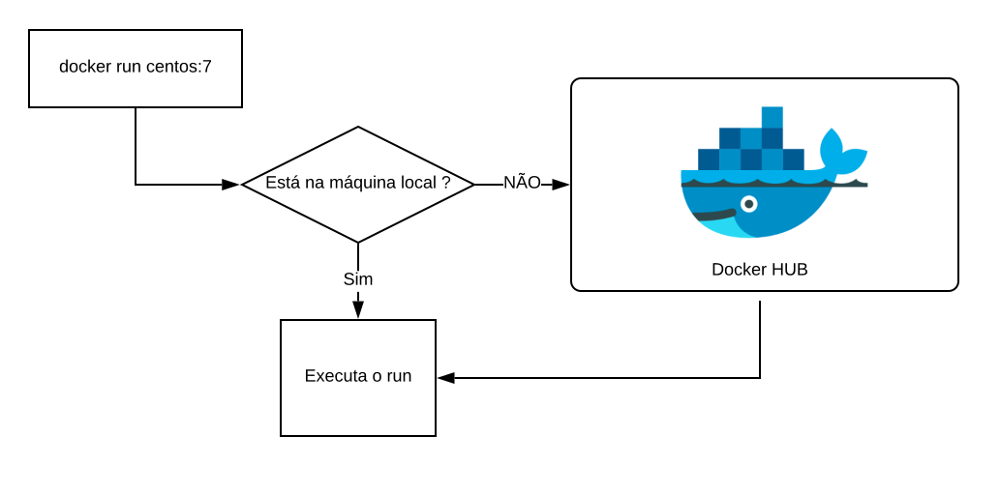

# Docker `r emo::ji("whale")`

Docker é uma plataforma para o gerenciamento de *containers* (@Schommer2014), que ajuda desenvolvedores e administradores de sistemas a desenvolver, distribuir, implantar e executar aplicações em ambientes isolados, sem problemas com dependências do ambiente ou configurações.

Ao utilizar o Docker, todos os problemas relacionados a instalação, configuração e dependências são facilmente resolvidos. Atualmente o Docker vem sendo aplamente utilizado por sua facilidade de uso e baixa utilização de recursos computacionais para a implantação de sistemas e execução de algoritmos.

Todo o funcionamento do Docker é baseado em uma comunicação cliente-servidor, onde o cliente, através de uma API Rest envia comandos para o docker-daemon, que por sua vez representa o gerenciador de *containers* que realiza todas as operações e verificações necessárias para o funcionamento correto e simples do Docker. Esta estrutura é resumida na Figura abaixo.

<center>
{width=400px, height=400px}
</center>

A forma como fazemos a utilização da estrutura acima pode variar, já que se trata de uma API Rest, básicamente, qualquer linguagem de programação que suporte a comunicação através de protocolos de rede como HTTP conseguem se comunicar e interagir com o docker-daemon. Veja a Figura abaixo.


Na Figura acima é possível entender como o processo de comunicação e interação com o docker-daemon funciona. O cliente envia comandos através da API Rest e o servidor recebe tais requisições, verifica sua validade e então realiza as operações necessárias.

Este tipo de estrutura permite que, através de uma máquina seja feito o gerenciamento de vários servidores Docker, sem contar que, por ser uma API Rest, aplicações podem fazer interações com o servidor, o que facilita ainda mais a criação e disponibilização de ferramentas para o gerenciamento de *containers* através do Docker.

O ambiente do Dockeré constituido por três componentes principais (@Chung2016), sendo eles, Docker images e Dockerfiles, Docker registry e Docker containers. Cada um desses explicados nas subseções seguintes.

## Instalação

Com a visão geral de funcionamento do Docker, vamos fazer sua instalação para começarmos a utilização e entender os conceitos na prática! Por uma questão de facilidade, recomenda-se a utilização de um ambiente Linux. 

Os passos abaixo, apresentam a instalação do Docker no Linux Ubuntu (16.04 ou superior).

```
$ curl -fsSL https://get.docker.com -o get-docker.sh
$ sudo sh get-docker.sh
```

Caso você queira permitir a execução do Docker para usuários que não sejam *root* você pode executar o comando abaixo

```shell
$ sudo usermod -aG docker seu-usuario
```

> Caso você não execute o comando de permissão acima, todos os seus comandos do Docker deverão ser executados pelo root ou junto ao comando `sudo`.

Feito! A instalação do Docker já está pronta e funcionando na sua máquina, para testar execute o comando `docker -v`, o retorno deve ser algo parecido com isto

```shell
Docker version 18.09.7, build 2d0083d
```

O comando `docker` e todos os seus parâmetros representam a ferramenta Docker CLI, que foi citada anteriormente e já vem instalada na distribuição padrão do Docker.

Se você estiver utilizado uma outra plataforma que não a apresentada acima, você pode consultar o site do Docker ([https://docs.docker.com/install/](https://docs.docker.com/install/)) para verificar como prosseguir com a instalação.

## Containers

*Containers* são instâncias de Imagens Docker que estão sendo executadas em ambientes isolados, sendo que, nestes ambientes há todos os recursos necessários para a execução do processo que foi definido. Por exemplo, quando você quiser executar um *container* com o Postgres, ao realizar a execução, dentro do ambiente que é gerado, todas as bibliotecas necessárias para a execução do Postgres, inclusive os binários do banco propriamente dito já estarão disponíveis.

## Imagens de containers

Como citado anteriormente, um *container* representa uma imagem Docker que está sendo executada. As imagens Docker, por sua vez, representam arquivos executáveis que possuem todo o descritivo de arquivos e processos que devem ser feitos no momento em que são executadas para a geração de um *container*.

Com isto, as imagens Docker garantem que, todos os *containers* gerados através da mesma imagem sejam padronizados, tendo uma mesma estrutura.

### Criando imagens

A criação de imagens Docker é feita através da utilização de arquivos `Dockerfiles`, estes que descrevem qual será a estrutura das imagens e suas operações.

Dentro do `Dockerfile` existem diversas instruções para ditar cada caracteristica que deve ser empregada na imagem que está sendo gerada. 

Para você entender melhor, vamos criar um exemplo de uma imagem Docker que gera um *container* que executa um *script* Python.

Vamos começar criando o *script* Python, fazemos isto utilizando o comando abaixo

```shell
echo "print('Oi! Esta é minha primeira imagem Docker! E ela funciona!')" > ola.py
```

Agora, no mesmo diretório onde está o arquivo do *script*, vamos criar um arquivo com o nome `Dockerfile`, dentro deste arquivo vamos inserir o seguinte conteúdo (Não se preocupe se você não entender agora, cada uma das partes deste arquivo será explicada). 

```shell
FROM python:3
COPY ola.py ./
  
CMD [ "./ola.py" ]
ENTRYPOINT [ "python" ]
```

Ao finalizar a edição do arquivo, vá até o diretório onde o arquivo está criado, e execute o comando `docker build`.

```shell
docker build -t "minha_primeira_imagem:1.0" .
```

Com este comando a sua imagem Docker será gerada Para verificar se ela realmente foi criada, execute o comando `docker images`, que lista todas as imagens disponíveis em sua máquina. Ao digitar este comando você perceberá que existe uma imagem com `REPOSITORY` de nome `minha_primeira_imagem:1.0`.

Para utilizar a imagem criada para gerar um container, vamos fazer a execução da imagem

```
docker run minha_primeira_imagem:1.0
```

> Caso queira apagar a imagem que criamos, utilize o comando `docker rmi` (docker rmi minha_primeira_imagem:1.0)

#### Entendendo o Dockerfile

Anteriormente foi visto um simples `Dockerfile`, que criou uma imagem para a execução de um *script* Python, vamos analisa-lo para entender o que foi feito.

Inicialmente no arquivo foi importado uma imagem com nome `python:3`, isto é feito com o comando `FROM`. Ou seja, sua imagem foi criada com base em uma outra image que já possuia o Python 3 instalado.

Após a definição da imagem base, foi feito uma cópia do *script* para dentro do *container*, através do comando `COPY`.

A definição do processo que o *container* irá executar é feita através do comando `ENTRYPOINT`, ou seja, no nosso caso o processo principal será uma execução python, e o comando `CMD` faz o auxílio ao processo principal, indicando os parâmetros que serão passados para o `ENTRYPOINY`.

Existem muitas outras instruções que poderiam ser aplicadas no `Dockerfile`, para saber mais sobre eles utilize a documentação do Docker ([https://docs.docker.com/engine/reference/builder/](https://docs.docker.com/engine/reference/builder/)).

#### Camadas de uma imagem

Para a geração de imagens, o Docker utiliza um conceito de camadas, onde cada comando do `Dockerfile` indica uma camada que será gerada na imagem. Estas camadas são utilizadas para permitir o versionamento da imagem e suas mudanças.

As camadas são organizadas como pilhas, onde a última camada sempre estará no topo, além disso, é sempre a última camada que pode ser modificada, todas as demais abaixo desta são *read-only*, não podendo ser modificadas. Para fazer mudanças em conteúdos das camadas *read-only* uma copia desta é criada e alterada.

Para entendermos melhor como as camadas funcionam, vamos criar um pequeno exemplo. Veja o seguinte `Dockerfile`.

```shell
FROM ubuntu

RUN apt update -y
RUN apt install vim -y

ENTRYPOINT [ "bash" ]
```

Ao executar o comando `docker build` com o `Dockerfile` acima, a seguinte estrutura de camadas será criada.

> A saída do comando `docker build` já apresenta as camadas que estão sendo criadas, onde para cada uma há um `ID`.


Para cada comando foi criado uma camada, que por sua vêz tem um peso. Das camadas 1 a 4 nada mais pode ser alterado, o que fez o exemplo acima ter um problema, quando o comando `apt update -y` foi executado, um *cache* foi criado e certamente não vai mais ser utilizado. O problema é que este *cache* ficou em uma camada *read-only* e não poderá mais ser modificado. Se o comando para limpar o *cache* for utilizado, a camada onde do *cache* será copiada para o topo e então editada.


Ou seja, mais uma camada foi criada, porém o *cache* ainda continua lá. Para resolve reste problema é preciso melhorar a forma como o `Dockerfile` foi criado, tentando executar tudo o que for possível em uma única camada, por exemplo.

```shell
FROM ubuntu

RUN apt update -y && apt install vim -y && apt clean

ENTRYPOINT [ "bash" ]
```

Com o `Dockerfile` acima, somente três camadas serão criadas, já que, toda a modificação para a instalação do `vim` é feita em uma única camada, que tem o *cache* removido.

<center>

</center>

> Com isto é possível perceber a necessidade de otimizar os `Dockerfiles` e evitar camadas desnecessárias que só ocupam espaço

Para saber mais formas de otimização de `Dockerfiles`, consulte a documentação do Docker ([https://docs.docker.com/develop/develop-images/dockerfile_best-practices/](https://docs.docker.com/develop/develop-images/dockerfile_best-practices/)).

### Aquisição de imagens

Além da criação é possível também fazer a aquisição de imagens disponibilizadas pela comunidade, ou mesmo distribuída por algum instituto ou empresa com seus sistemas já configurados e prontos para a execução.

Para isso utiliza-se o Docker Registry, um componente que está dentro da plataforma Docker e que facilita muito a distribuição de imagens. Registry pode ser público ou privado. Um exemplo muito útil de Registry público é o [Dockerhub](https://hub.docker.com/).

Por fazer parte da plataforma, o registry já está integrado ao funcionamento do docker-daemon. Vamos fazer alguns testes para entender. 

Com o comando `docker images`, liste todas as imagens em sua máquina. Você provavelmente terá a imagem criada e a imagem do `python:3` (Você já vai entender de onde ela veio).

Vamos então tentar executar uma imagem que não está na sua máquina.

```shell
docker run centos:7
```

Mesmo você não tendo a imagem nomeada `centos:7` em sua máquina o comando está sendo executado, isso porque o docker-daemon, por padrão, ao não encontrar em sua máquina vai até o Docker hub e verifica se tem uma imagem com o nome que você inseriu, caso tenha ele baixa e continua a execução de seu comando. Veja este fluxo na Figura abaixo.



Durante os passos da criação do [Dockerfile](#criando-imagens) essa *feature* foi utilizada, ao inserir a imagem de nome `python:3` na instrução `FROM` do `Dockerfile`, o `docker-daemon` verifica se há a imagem na máquina, como não tinha ele baixou para então continuar a criação da imagem.

## Arquitetura

Com todos os componentes básicos do Docker já conhecidos, há a possibilidade de expansão da visão geral de toda a estrutura e funcionamento do Docker. Inicialmente na parte estrutural haviamos definido apenas a forma de comunicação, veja agora na Figura abaixo, como todos os componentes apresentados até aqui fazem integração.

<!-- Será adaptado de: https://www.aquasec.com/wiki/display/containers/Docker+Architecture?preview=/2854889/2854891/Docker_Architecture.png -->


Com isso estamos prontos para iniciar as atividades práticas com o Docker e o gerenciamento de *containers*.

## Administrando containers
<!-- Portainer -->

Esta seção apresenta exemplos para a administração de *containers* através da utilização do Docker CLI.

### Criando containers

Vamos começar com exemplos das diferentes formas de criação de *container*. Começando com a criação básica de um *container* do Debian.

```
docker create debian
```

Depois de criar, utilize o comando `docker ps -a` para listar todos os *containers* criados. Quando você listar, vai ver várias informações sobre o *container* criado, como por exemplo a imagem que ele utilizou, o ID, se há portas de rede abertas e o nome. Por padrão, não é necessário definir o nome do *container*, mas é recomendado que o faça, então vamos excluir o *container* criado e gerar um novo com um nome definido.

```shell
# Excluíndo container
docker rm ID_DO_CONTAINER_CRIADO

# Criando um novo container de nome exemplo_debian
docker create --name exemplo_debian debian
```

Ao utilizar novamente o comando `docker ps -a`, você vai ver o novo *container*, com o nome que foi definido. O *container* ainda não está sendo executado, uma vez que apenas fizemos sua criação, vamos então executar ele com o comando `docker start`.

```shell
docker start exemplo_debian
```

Ele foi executado, para listar somente os *containers* que estão sendo executados, utilize o comando `docker ps`, sem qualquer outro parâmetro.

Sua listagem estará vazia já que o *container* do Debian está configurado para executar o comando `bash`, então, ao iniciarmos o *container* ele executou o comando e em seguida finalizou, se quisermos manter o *container* ligado, devemos definir que ele terá um terminal interativo, para isto no momento da criação, os parâmetros `-ti` devem ser passados. Vamos lá então, excluir o que haviamos criado e gerar ele novamente com os novos parâmetros


```shell
# Excluíndo container exemplo_debian
docker rm exemplo_debian

# Gerando um novo container que trabalha em segundo plano
docker create -ti --name exemplo_debian debian

# Executando o novo container criado
docker start exemplo_debian
```

Ao executar os comandos o novo *container* já estará sendo executado, para verificar, liste novamente os *containers* em execução. Vamos agora acessar o container criado, para isto usamos o comando `docker attach`, que recupera o `bash` do *container* caso ele não esteja executando outro processo.

```
docker attach exemplo_debian
```

> Em outros cenários o `bash` pode não estar disponível, então ao invês do `docker attach` pode ser utilizado o `docker exec` ([https://docs.docker.com/engine/reference/commandline/exec/](https://docs.docker.com/engine/reference/commandline/exec/))

Feito o `attach` você estará dentro do terminal do *container*. Como dito anteriormente, este ambiente é isolado de sua máquina, então faça testes, navegue entre os diretórios, para você ver que é uma instância completamente isolada. Para sair do terminal e não finalizar o *container* utilize os seguintes botões de seu teclado: `CTRL + p + q`. Ao listar novamente os *containers* em execução, lá estará ele sendo executado.

Nos exemplos anteriores criavamos o *container* depois faziamos sua execução, porém podemos já criar um *container* e imediatamente realizar sua inicialização, para isto utilizamos o comando `docker run`, que recebe os mesmos parâmetros que o `docker create`, com a diferença de que ele executa o *container* após sua criação.

```
docker rm -f exemplo_debian

docker run -ti --name exemplo_debian debian
```

> Executando o comando acima, o *container* irá iniciar e você já estará em seu `bash`.

### Gerenciando as execuções de um container

Com os *containers* em execução, vamos entender quais são os estados de um *container* e como podemos fazer a manipulação desses.

Ao criar um *container* com `docker create` o *status* dele é `CREATED` e as modificações dessa estado são feitos com os comandos na Tabela abaixo, junto aos comandos, há os estados que eles geram no *container*.

| Comando | Estado gerado |
|---------|---------------|
| docker create  | CREATED       |
| docker run     | UP            |
| docker start   | UP            |
| docker stop    | EXITED        |
| docker restart | UP            |
| docker pause   | UP (PAUSED)   |
| docker unpause | UP            |

Para entender cada um dos estados que estes comandos geram em um *container* vejamos a Tabela abaixo.

| Estado      | Descrição                                                                                                     |
|-------------|---------------------------------------------------------------------------------------------------------------|
| CREATED     | Representa que o container foi criado, possui uma camada que pode ser escrita e está pronto para ser iniciado |
| UP          | Indica que o container está em execução                                                                       |
| UP (PAUSED) | Indica que o container está "ligado" porém sua execução está parada                                           |
| EXITED      | Indica que a execução do container foi finalizada                                                             |

Estes estados nos ajudam a entender o que está ocorrendo com os *containers*, se estão trabalhando sem nenhum problema ou mesmo se estão ou não sendo executados.

### Visualizando status do container

Além do estado do *container*, em certos casos é necessário avaliar outras informações do container. A Tabela abaixo descreve comandos que podem ser úteis para a avaliação e verificação de status dos *containers*.

| Comando         | Descrição                                                                                                                               |
|-----------------|-----------------------------------------------------------------------------------------------------------------------------------------|
| docker stats    | Exibe estatísticas de utilização de recursos feitas pelo container em tempo real                                                        |
| docker top      | Exibe os processos que estão sendo executados no container                                                                              |
| docker logs     | Exibe os logs do container. A forma que os logs são exibidas depende da forma como o serviço que está sendo executado registrou os logs |
| docker inspect  | Exibe informações gerais do container, no formato JSON                                                                         |

### Gerenciamento de memória e CPU

Durante as verificações de estado e utilização de um *container*, pode ser necessário atribuir limites de utilização, evitando o consumo excessivo de recursos, que pode prejudicar o servidor onde o Docker está trabalhando.

> Quando não é atribuido limites de recursos a um *container*, se necessário, ele pode consumir todos os recursos da máquina onde está sendo executado.

Vamos começar criando um *container* normalmente, como haviamos feito até aqui.

```
docker run -ti --name debian_de_teste debian
```

Agora, com a ajuda do comando `docker inspect`, vamos avaliar a quantidade de memória configurada para uso deste *container*.

```
docker inspect debian_de_teste | grep -i memory
```

A saída do comando acima é parecida com isto:

```
"Memory": 0,
"KernelMemory": 0,
"MemoryReservation": 0,
"MemorySwap": 0,
"MemorySwappiness": null,
```

O campo `Memory` está com valor 0, isto indica que, para este *container* não há limitação de uso de memória. Para resolver este problema, vamos excluir este *container* e gerar um novo com um limite de memória.

```
# Excluíndo container sem limite de memória
# -f Para excluir mesmo se o container estiver com estado UP
docker rm -f debian_de_teste

# Criando container com limite de 512 MB
docker run -ti --name debian_de_teste --memory 512m debian
```

Após os comandos, caso eu execute novamente o `docker inspect` será possível visualizar a mudança no limite de memória.

```
docker inspect debian_de_teste | grep -i memory
```

Saída:

```
"Memory": 536870912,
"KernelMemory": 0,
"MemoryReservation": 0,
"MemorySwap": -1,
"MemorySwappiness": null,
```

Com isso, o *container* não vai consumir mais que 512 MB de memória da máquina onde está sendo executado. Outra cenário possível para a mudança de quantidade de memória é quando o *container* já está funcionando e você precisa mudar seu limite de memória. Isto pode ser feito através do comando `docker update`.

Vamos mudar a quantidade de memória do *container* de testes que geramos acima.

```
docker update --memory 256m debian_de_teste
```

> O comando `docker update` básicamente recebe o parâmetro que precisa ser alterado, o novo valor e o `container id` ou `container name` para fazer a mudança.

Ao consultar novamente a quantidade de memória, veremos que ela foi atualizada para 256 MB

```
"Memory": 268435456,
"KernelMemory": 0,
"MemoryReservation": 0,
"MemorySwap": -1,
"MemorySwappiness": null,
```

Além da memória pode ser necessário limitar a quantidade de CPU que o *container* pode utilizar. Todos os principios apresentados na mudança de memória podem ser aplicados aqui, ou seja, pode ser atribuido valores de limitação na criação ou em *containers* já em execução, o ponto para a CPU é que os valores atribuidos funcionam um pouco diferentes, através de uma lógica de proporção.

Vamos para um exemplo, neste três *containers* serão criados.

```
docker create -ti --name debian_1 --cpu-shares 1024 debian
docker create -ti --name debian_2 --cpu-shares 512 debian
docker create -ti --name debian_3 --cpu-shares 512 debian

docker start debian_1 debian_2 debian_3
```

> O parâmetro `--cpu-shares` é quem define os valores de utilização da CPU

> Lembre-se que, para sair do container sem fecha-lo utilize as teclas `CTRL + p + q`.

Após criar os três *containers* vamos entender o pensamento por trás da proporcionalidade. O primeiro *container* possui 1024 `cpu-shares` e os outros dois *containers* criados possuem 512 `cpu-shares` cada. O segundo e o terceiro *container* criados, tem cada um 50% do valor atribuido para o primeiro *container*. 

Quando todos os valores atribuidos a cada *container* são somados, chegamos em um valor de 2048. Sobre este valor, se aplicarmos uma proporcionalidade, é possível entender que o primeiro *container* possui 50% do valor total e os outros dois 25% cada um. Estes valores da proporcionalidade, são exatamente as quantidades que cada um poderá utilizar do 100% total de utilização da CPU, assim, o primeiro poderá utilizar até 50%, enquanto os outros dois poderão utilizar até 25% cada um.

> Lembrando que o comando `docker update` funciona da mesma forma como apresentado no controle de memória, com a diferença de que o parâmetro inserido para este caso será o `--cpu-shares`.

### Armazenamento

Para finalizar este conteúdo básico sobre Docker, vamos tratar de algumas formas de armazenamento possíveis nos *containers*. Existem três formas possíveis de armazenamento em um *container*, cada uma dessas formas é apresentada na Tabela abaixo.

| Tipo de armazenamento | Descrição                                                                                                                                                                      |
|-----------------------|--------------------------------------------------------------------------------------------------------------------------------------------------------------------------------|
| Volumes               | São formas de armazenamento que ficam registradas em lugares específicos do sistema de arquivos da máquina que executa o Docker e todo seu controle é feito pelo docker-daemon |
| Bind mounts           | Podem ser armazenados em qualquer lugar do sistema de arquivos da máquina que executa o Docker e o docker não faz seu gerenciamento                                            |
| tmpfs                 | Sistema de arquivos temporários criados diretamente na memória e não são salvos                                                                                                |

A escolha dentre essas possibilidades pode variar de acordo com seu cenário de utilização. Não deixe de consultar a documentação do Docker para dicar e formas de utilização de cada uma dessas ([https://docs.docker.com/storage/](https://docs.docker.com/storage/))

Cada uma dessas formas listadas na Tabela anterior, indicam formas de criar mapeamentos de unidades e arquivos entre o *container* e a máquina onde o docker-daemon está sendo executado. Veja a Figura abaixo.

<center>

</center>

Como é possível perceber na Figura acima, o mapeamento faz básicamente com que os arquivos ou diretórios do sistema de arquivos do *container* sejam armazenados em outros contextos que não o do próprio *container*, tendo como formas de mapeamento, os itens listados na Tabela acima.

Vamos focar aqui em apresentar os `Volumes` e os `Bind mounts`. Vamos começar criando um *container* que possui um volume.

```
docker run -ti -v /volume --name ubuntu_com_volume ubuntu
```

Ao executar o comando e estar dentro do *container* vá até o diretório raiz `/` e execute o comando `ls`, para listar os diretórios.

Na listagem você verá que há um diretório de nome `volume`, acesse ele e crie um arquivo qualquer.

```
cd /volume && > arquivo_qualquer.txt
```

Feito isto, vamos sair do *container* e verificar em qual local do disco o *volume* foi criado.

> Para sair do *container* não esqueca de utilizar o `CTRL + p + q`, o que evita a finalização do processo principal do *container*.

Após sair vamos verificar onde o volume foi criado com o auxílio do comando `docker inspect`.

```
docker inspect -f {{.Mounts}} ubuntu_com_volume
```

> O parâmetro `-f` ajuda na filtragem do comando `docker inspect`.

A saída do comando é parecido com isto

```
[{volume 3af1c580d4679973c86fbe7b6cdc755595a726f41aec7c8c59186f10885732fa /var/lib/docker/volumes/3af1c580d4679973c86fbe7b6cdc755595a726f41aec7c8c59186f10885732fa/_data /volume local  true }]
```

Veja que, ele indica onde o diretório `/volume` que foi montado dentro do *container* está na máquina local. Vamos então acessar este diretório e verificar seu conteúdo.

```
cd /var/lib/docker/volumes/3af1c580d4679973c86fbe7b6cdc755595a726f41aec7c8c59186f10885732fa/_data
```

Após mudar o diretório e listar seu conteúdo, você provavelmente verá o arquivo que foi criado `arquivo_qualquer.txt`, isto ocorre já que, como foi explicado, os *volumes* permitem o mapeamento de arquivos e diretórios que estão presentes no sistema de arquivos do *container*.

Outra da forma de realizar o mesmo processo é fazendo a utilização de *bind mounts* que evita a criação de *volumes* e permite que o mapeamento seja feito diretamente entre um diretório/arquivo da máquina onde o docker-daemon é executado e um diretório/arquivo do *container*. Para vermos isto na prática, vamos excluir o *container* de testes que criamos anteriormente e gerar um novo contendo esta forma de mapeamento.

```
# Excluindo o container gerado anteriormente
docker rm -f ubuntu_com_volume

# Gerando container com bind mounts
mkdir /arquivos_containers

docker run -ti -v /arquivos_containers:/volume --name ubuntu_com_volume ubuntu
```

> Antes de criar o *container* foi necessário criar um diretório, isto porque este será vinculado diretamente com o `/volume` que está dentro do *container*, assim, todo o conteúdo que foi criado lá, estará sendo criado dentro deste diretório que foi gerado.

Dentro do *container*, vá até o diretório `volume` e crie um arquivo qualquer.

```
cd /volume && > arquivo_qualquer_2.txt
```

Agora saia do *container* e liste o diretório `/arquivos_containers`, você vai perceber que o arquivo criado no *container* está lá.

Lembrando que, a forma que você escolher para mapear os dados pode depender completamente de seu contexto e sua necessidade.

Então, chegamos ao fim desta parte da documentação, tudo o que foi mostrado até é um guia básico de como realizar a utilização do Docker, não deixe de conferir a documentação no site oficial e também de fazer testes para ir aprendendo mais!

<!-- ### Rede -->

<!-- ## Um pouco mais sobre o ecossistema Docker `r emo::ji("octopus")` -->
