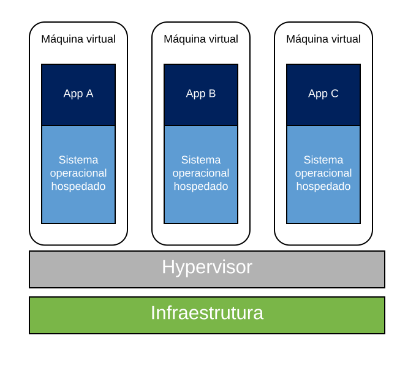
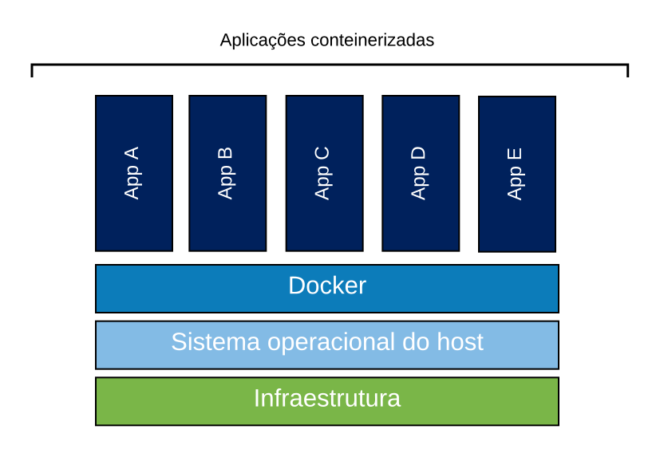

# Introdução

Desde seu surgimento, o Docker tem ganhado cada vez mais espaço nos servidores mundo a fora, suas caracteristicas fáceis de entender e simples de aplicar permitem sua utilização nos mais variados cenários.

No âmbito científico, o Docker vem sendo utilizado cada vez mais para a garantia da reprodutibilidade, uma vez que, suas características de isolamento de ambiente munidos da eficiência, permitem a fácil distribuição de ambientes já configurados para a execução dos trabalhos desenvolvidos, como @Boettiger2014 e @Schommer2014 apresentam.

O Instituto Nacional de Pesquisas Espaciais (INPE), por exemplo, faz a utilização do Docker, para tornar os sistemas científicos computacionais desenvolvidos mais acessível para todos que queiram fazer sua utilização de uma forma simples e rápida.

Neste contexto, este material busca realizar uma introdução do Docker e os principais conceitos envolvidos na utilização desta ferramenta. A criação deste material foi feita para ajudar a todos que queiram começar a utilizar o Docker em seu dia-a-dia `r emo::ji("smile")`.

## Por que Docker ?

A resposta para esta pergunta pode ter várias respostas, uma vez que, a depender do contexto onde você está inserido, o Docker pode trazer muitos benefícios, vou colocar aqui em um contexto mais relacionado ao desenvolvimento de aplicações. Então, vamos começar imaginando que você é um desenvolvedor Python, que está trabalhando em vários projetos.

O primeiro projeto que você está trabalhando, está relacionado ao desenvolvimento de uma aplicação *web* e para isso, tem utilizado o PostgreSQL e Django, para realizar o desenvolvimento, já o segundo projeto, está ligado ao processamento de dados geoespaciais e você utilizou o GDAL e o numpy. Tudo bem até aqui ? É um cenário simples de imaginar.

Bem, como você desenvolve na mesma máquina e é um desenvolvedor Python com bastante experiência em projetos, entende que, as dependências do projeto *web* não podem interferir no projeto de processamento de geodados. Para resolver este problema você cria ambientes virtuais dentro do Python, com isso, você consegue separar os projetos e garantir que, as bibliotecas e dependências de um projeto em momento algum irão interferir em outro projeto, além de permitir que você controle melhor as dependências de cada projeto.

Legal até aqui nada de diferente, e nem de Docker! 

> Calma, não vou te enrolar, quero apenas que você entenda uma situação problema

Então, você finaliza os dois projetos e eles devem ser distribuidos para todos e é aqui que os problemas começam, durante a instalação das dependências, você percebeu que, dependendo da versão do S.O, a biblioteca que você utilizou para se conectar ao PostgreSQL, SQLAlchemy, apresenta problemas quando tenta ser instalado com o `pip`, o que faz a instalação dos `requirements.txt` dar problemas. E ainda, no projeto de processamento, uma das dependências, o GDAL, que facilita a leitura de dados espaciais também tem o mesmo problema, dependendo da plataforma, ele tem problemas para instalar.

Ops! Os projetos estão prontos, porém as dependências podem dificultar a utilização e implantação deles. É aqui que entra o Docker, você vai criar duas *imagens* (Serão apresentadas mais para frente no material) com todo o seu projeto e o Docker vai garantir que, independende da plataforma ou do OS utilizado, eles vão funcionar.

Veja que interessante! Com o Docker, o famoso "Na minha máquina funciona" deixa de existir, e o projeto vai funcionar em todas as plataformas. Este é um pequeno exemplo de o porque utilizar Docker, outros poderiam ser colocados aqui.

> Esta mini história foi inserida apenas para você entender que o Docker pode te ajudar em problemas do dia-a-dia.

## Virtualização

Bem, para começarmos a falar de Docker, vamos antes falar um pouco sobre virtualização, um conceito fundamental no entendimento do funcionamento do Docker.

Virtualização é o processo de criar ambientes virtuais isolados, providos por alguma ferramenta de geração deste ambiente (@Soltesz2007), sendo que existem duas formas de prover estes ambientes virtuais (@Chung2016), sendo elas as baseadas em container e as baseadas em hypervisor (@Morabito2015). 

Na virtualização baseada em hypervisor é criado a representação virtual de um *hardware* (@Firesmith), também chamada de MV, que é controlada por um hypervisor, sendo este uma camada que faz o intermédio de recursos entre o ambiente virtual criado e o *hardware*, e neste ambiente virtual gerado, sistemas operacionais comuns podem ser executados. Esta representação de *hardware* é completamente isolada da máquina onde está sendo alocada (@Morabito2015), o que permite, por exemplo, que uma máquina que gera uma MV seja Linux, e o ambiente instalado dentro da MV seja Windows (@Morabito2015). O ponto de troca aqui é que, o sistema operacional terá de ser instalado por completo dentro da MV (@Morabito2015).

A Figura abaixo apresenta a arquitetura das virtualizações hypervisor.



Veja na Figura que, acima do hypervisor, que gera as representações virtuais de ambientes de execução, são instalados todo o sistema operacional e então, as aplicações podem começar a ser executadas.

Por outro lado existem as técnicas de virtualização baseadas em containers, que são executadas a nível de sistema operacional (@Firesmith), que realiza a emulação de sistemas operacionais, ou partes de um, para a execução de processos e aplicações, o grande diferencial desta forma de virtualização é que, um novo sistema operacional não precisa ser instalado, uma vez que, as máquinas emuladas terão como base o kernel e as bibliotecas do sistema operacional base, onde está sendo feito a virtualização.

> É neste tipo de virtualização que o Docker se encaixa.

Mesmo com a caracterisca de compartilhamento de kernel e bibliotecas, os ambientes emulados continuam sendo isolados uns dos outros. Na Figura abaixo é possível visualizar como este método de virtualização funciona.



Veja que, não há representação de várias máquinas sendo criadas, e sim de aplicações que estão sendo executadas, já que, neste método de virtualização, cada um dos ambientes criados, também chamados de *containers*, normalmente executam um único processo, que pode por exemplo, ser a execução de uma aplicação *web*, ou mesmo um terminal *bash*.

<!--chapter:end:01-intro.Rmd-->

<!-- A ordem dos conteúdos listados abaixo podem mudar -->

# Docker `r emo::ji("whale")`
<!-- Explicar o docker daemon aqui também -->

<!-- Existing Tools for Reproducible Research in Science Docker -->
O Docker é uma plataforma que usa o Linux Containers (LXC) para encapsular completamente aplicativos de software. É um projeto de código aberto apoiado por uma empresa privada que tem se concentrado no desenvolvimento do Docker como uma plataforma para hospedagem de aplicativos web fácil e escalável.

O LXC é uma tecnologia de virtualização em nível de sistema operacional que cria um ambiente virtual totalmente em área restrita no Linux sem a sobrecarga de uma máquina virtual completa. O Docker estende a tecnologia LXC, facilita o uso e fornece versões, distribuição e implantação fáceis. A sobrecarga de um contêiner do Docker é muito menor que uma máquina virtual tradicional porque não replica o sistema operacional completo, apenas as bibliotecas e binários do aplicativo sendo virtualizados.

Um contêiner Docker é executado em um ambiente totalmente virtualizado, portanto, um algoritmo pode ser executado usando qualquer linguagem compatível com Linux (R, Python, C, Matlab, etc.) e ser compilado usando qualquer biblioteca compatível com Linux sem causar conflitos de versão ou biblioteca com outros algoritmos. Além disso, um contêiner Docker pode ser exportado e arquivado e executado a qualquer momento no futuro, com a confiança de que o ambiente computacional será idêntico, supondo que o projeto Docker permaneça compatível com versões anteriores.
<!-- ------------------------- -->

Docker é uma aplicação cliente-servidor, ou seja, toda sua comunicação é baseada em troca de dados através de algum protocolo entre um cliente e o serviço docker que está alocado no servidor. <!-- Acho que a explicação do docker daemon deve vir aqui! -->


<!-- Fazer uma versão mais simples dessa imagem -->
<!--  -->

<!-- Docker é formado por três componentes principais (@Chung2016) Docker images, registry e containers [...].  -->

<!-- Explicar aqui o que é o docker -->
<!-- Falar das versões que estão disponíveis (Linux, MacOS e Windows). Deixar claro que a recomendação de uso é no Linux -->
<!-- Ao falar sobre a causa da recomendação da utilização no Linux, falar que isto tem haver com a forma como o docker é integrado com o sistema -->
<!-- ## Vantagens de utilização -->
<!-- Docker é um gerenciador de containers -->
<!-- Existing Tools for Reproducible Research in Science Docker ajuda a explicar o que é e como funciona -->

## Instalação

<!-- Verificar as versões compativeis! -->
Agora que temos uma visão geral de funcionamento do docker, vamos fazer sua instalação para podemos começar a testar esta ferramenta e entender seus conceitos na prática. Aqui, por uma questão de facilidade, recomenda-se a utilização de um ambiente Linux. Os passos abaixo descrevem como a instalação do Docker pode ser feita no Ubuntu |16.04| ou superior.

```
# Comandos para a instalação do Docker no Ubuntu
curl -fsSL https://get.docker.com -o get-docker.sh
sudo sh get-docker.sh

# sudo usermod -aG docker your-user
```

Ao fazer esta instalação você já tem tudo o que é necessário para o funcionamento do Docker em sua máquina.

Caso você esteja em outra plataforma, você pode consultar o site do Docker para verificar como instala-lo para a plataforma que você está, para isto clique [aqui](#)

## Containers

<!-- An Introduction to Docker and Analysis of its Performance -->
Os contêineres armazenam todo o kit necessário para um aplicativo, portanto, o aplicativo pode ser executado de forma isolada. Por exemplo, suponha que haja uma imagem do sistema operacional Ubuntu com o SQL SERVER, quando essa imagem for executada com o comando docker run, será criado um contêiner e o SQL SERVER será executado no sistema operacional Ubuntu.
<!-- -------------------------------- -->

São nos *containers* que as aplicações, algoritmos e ambientes serão executados e trabalhados [...]. Mas você pode estar se perguntando: "Como são gerados os containers ?", bem os containers são criados através da utilização de imagens, e básicamente um container representa uma imagem em tempo de execução. 

Bom, agora precisamos entender o que são as imagens de containers. <!-- algo assim [...] -->

<!-- Certo, mas agora podem surgir outras dúvidas, como "O que são imagens ?" ou "Como imagens são geradas ?", para responder estas perguntas, vamos para a próxima seção. -->

## Imagens de containers
<!-- Como citado, o docker trabalha com containers, porém para entender melhor o conceito de containers dentro do docker, vamos começar falando um pouco sobre imagens docker, estes que são a base para a criação de containers no Docker -->
<!-- Uma imagem docker representa uma receita de criação de um container -->
Agora que entendemos o que é um *container*, vejamos como eles são criados. Como já apresentado anteriormente, os containers são criados a partir de imagens, mas o que são essas imagens ? Imagens básicamente representam uma receita para a criação de *container*. 

Com esta receita os *containers* podem ser criados de forma padronizada, seguindo sempre a mesma estrutura para a geração de ambientes e execução de sistemas. Mas agora você pode estar se perguntando, de onde vieram as imagens, bem, elas também possuem uma receita durante sua geração, esta receita é conhecida como **Dockerfile**. Vamos explicar como ela funciona.
<!-- Viu! Em docker todo o ambiente é criado com base na transformação de `receitas`, onde a receita base da origem a outra receita, que por sua vez pode ser utilizado em outra criação -->

Para ilustrar melhor, vejamos a figura abaixo, que apresenta a relação entre o dockerfile, a imagem e um container.


### Criando imagens

Para realizar a criação de imagens, como citado, utilizados os `Dockerfiles`, esses que são arquivos que descrevem tudo o que um container deve ter quando for executado. Dentro do `Dockerfile` existem instruções para ditar cada caracteristica que deve ser empregada no container. Para que você entenda melhor, vou mostrar um pequeno arquivo Dockerfile que cria um container que exibe uma mensagem e então é finalizado. Não se preocupe caso você não entenda de primeira, sem problemas! Vou explicar cada parte para ficar bem claro para você.
- Lista os containers ativos: `docker ps`

- Lista todos os containers - (Independente do status): `docker ps -a`

- Lista todas as imagens: `docker images`

- Execução de um container: `docker run`


Nossa primeira imagem ira executar um script Python. Para começarmos a fazer isso, vamos criar o *script* python.

```shell
echo "print('Oi! Esta é minha primeira imagem Docker! E ela funciona!')" > ola.py
```

Com o *script* python criado, vamos criar um arquivo com o nome `Dockerfile`, dentro deste arquivo, vamos inserir o seguinte conteúdo.

```shell
FROM python:3
COPY ola.py ./

CMD [ "python", "./ola.py" ]
```

Pronto! Ao fazer isto, basta ir novamente ao terminal e gerar a imagem, para fazer isso, utilize o comando que segue

```shell
docker build -t "minha_primeira_imagem" .
```

Com este comando a sua imagem Docker será criada. Para verificar se ela realmente foi criada execute o comando `docker images`, que lista todas as imagens disponíveis para você utilizar. Ao digitar este comando você perceberá que haverá uma imagem com `minha_primeira_imagem`.

> Caso queira apagar a imagem que criamos, utilize o comando docker rmi (docker rmi minha_primeira_imagem)

Para utilizar a imagem criada para gerar um container, vamos fazer a execução da imagem

```
docker run minha_primeira_imagem
```

<!-- Aqui são utilizados os Dockerfiles -->
<!-- ENTRYPOINT, CMD, RUN, EXPOSE -->

<!-- Camadas - Ao falar da criação da imagem, já explicar a saída, dizendo o que são as camadas --> 
<!-- Após apresentar o Dockerfile e de gerar uma imagem, fale do output gerado durante a criação da imagem, diga que estas são as camadas e aqui vem a explicação do que são essas camadas. É bom recomendar que o arquivo não tenha muitas camadas, para que ele não fique grande, além do mais, as camadas read-only não podem ser alteradas! -->
<!-- https://medium.com/@jessgreb01/digging-into-docker-layers-c22f948ed612 -->
<!-- https://dzone.com/articles/docker-layers-explained -->

### Aquisição de imagens

Bem, mas existe alguma forma de eu compartilhar minhas imagens, ou mesmo utilizar alguma já feita pela comunidade, ou ao menos compartilhar meu Dockerfile? Sim! Você pode fazer isto através da utilização do registry! E você já fez a utilização deste serviço! Lembra na seção anterior durante a criação do `Dockerfile`? Então, ali existia uma instrução `FROM`, como explicado anteriormente, isso faz com que a sua imagem seja criada com base na imagem com o nome que você colocou, porém, se você lembrar foi inserido a seguinte instrução `FROM python:3`, bem, mas você não tem uma imagem na sua máquina com o nome `python:3`, ou pelo menos não tinha até a execução do comando ? E como o docker faz isso, ele utiliza o registry!

Quando pedimos a execução de uma imagem, ou mesmo a utilização dela para a criação de outra imagem, o docker-daemon busca esta imagem na sua máquina, caso não encontra, vai para o registry público, este nomeado de docker hub, lá, caso ele encontre a imagem com o nome e a tag que você definiu, ele baixa ela e utiliza na operação que você definiu.

<!-- Podemos buscar imagens do registry, este que é um repositório que aloca uma serie de images Docker [...] -->

## Arquitetura

Bem, agora que já conhecemos os principais componentes do ecossistema docker, vamos ampliar a imagem que apresenta a estrutura de funcionamento do docker cliente-servidor, naquele momento estavamos preocupados apenas em saber como nós, clientes docker, nos poderiamos nos comunicar com o docker deamon, porém agora sabemos bastante sobre o ambiente docker.

Vejamos a figura abaixo:

<!-- Será adaptado de: https://www.aquasec.com/wiki/display/containers/Docker+Architecture?preview=/2854889/2854891/Docker_Architecture.png -->


Perceba que, o principio básico que já haviamos visto ainda está presente, onde através de uma API ou ferramenta de linha de comando (Que também utiliza a API) nos comunicamos com o *docker daemon*, porém agora podemos entender melhor que esta comunicação representa. Veja que, ao nos comunicarmos com o docker daemon, podemos criar e gerenciar imagens, ou mesmo baixa-las do registry e então criar *containers* a partir delas. Com isso temos um entendimento geral de como o docker trabalha, e agora podemos começar a fazer sua gerencia =D.

## Administrando containers
<!-- Agora que já sabemos o que são containers e sua relação com as imagens, vamos começar a entender como trabalhar com o gerenciamento de containers no Docker -->
<!-- Falar que, há ferramentas que podem ajudar no gerenciamento, uma delas é o portainer  -->

### Criando containers
Os comandos aqui listados já foram apresentados anteriormente, porém, foram colocados aqui apenas para reforçar o significado de cada um dos parâmetros inseridos

### Gerenciando as execuções de um container
<!-- docker create|run|stop|restart|start|unpause|rm -->

### Visualizando o status do container
<!-- docker stats|top|logs -->

### Gerenciamento de memória e CPU


### Armazenamento
<!-- data folder, volumes e container data-only -->

### Rede

## Um pouco mais sobre o ecossistema Docker `r emo::ji("octopus")`

<!--chapter:end:02-docker.Rmd-->

# Docker Cheat Sheet `r emo::ji("books")`

Recomenda-se que esta página seja utilizada para consulta, trazendo ao leitor uma forma simples e direta de consultar comandos do `Docker CLI` que lhe podem ser úteis.

- Listando os containers ativos: `docker ps`

- Listando todos os containers - (Independente do status): `docker ps -a`

- Listando todas as imagens: `docker images`

- Executando um container: `docker run`

- Executando um container - (Com terminal interativo): `docker run -ti debian /bin/bash`

- Executando um container como daemon: `docker run -d`

- Saindo do *shell* de container sem finaliza-lo: CTRL + p + q

- Finalizando um container (Quando conectado em seu *shell*): CTRL + d

- Acessar o entrypoint de um container em execução: `docker attach CONTAINER_ID`

- Criando o container: `docker create centos`

- Parando um container: `docker stop CONTAINER_ID`

- Iniciando um container: `docker start CONTAINER_ID`

- Pausando um container: `docker pause CONTAINER_ID`

- Despausando um container: `docker unpause CONTAINER_ID`

- Verificando a quantidade de recursos utilizados pelo container: `docker stats CONTAINER_ID`

- Verificando os processos de um container: `docker top CONTAINER_ID`

- Visualizando os logs: `docker logs CONTAINER_ID`

- Removendo container desligado: `docker rm CONTAINER_ID`

- Removendo container em execução: `docker rm -f CONTAINER_ID`

- Verificando todas as informações de um container: `docker inspect CONTAINER_ID`

- Nomeando container no momento da execução: `docker run -ti --name teste debian`

- Verificando informações de memória de um container: `docker inspect CONTAINER_ID | grep -i mem`

- Limitando memória RAM na execução do container (512 MB neste caso): `docker run -ti --memory 512m --name limited_mem debian`

- Alterando quantidade de memória de um container já existente (256 MB neste caso): `docker update CONTAINER_ID --memory 256m`

- Limitando CPU de um container no momento da execução (Neste caso proporção de 1024): `docker run -ti --cpu-shares 1024 --name container1 debian`

- Alterando limite de CPU em container em execução (Neste caso proporção de 512): `docker update CONTAINER_ID --cpu-shares 512`

- Criando volume: `docker run -ti -v /volume /bin/bash`

- Mapeando volume: `docker run -ti -v /path/to/volume_dir:/volume debian`

- Verificando informações de volume: `docker inspect -f {{.Mounts}} CONTAINER_ID`

- Criando container data-only: `docker create -v /data --name dbDados centos`

- Criando container de banco de dados (Postgres) que utiliza o data-only: `docker run -d -p 5432:5432 --name pgsql1 --volumes-from dbdados -e POSTGRESQL_USER=docker -e POSTGRESQL_PASS=docker -e POSTGRESQL_DB=docker kamui/postgresql`

- Fazendo build de um Dockerfile que está no diretório atual: `docker build -t INSTITUICAO/NOME_DA_IMAGEM:VERSAO .`

- Definindo DNS do container na execução: `docker run -ti --dns ENDERECO_DNS debian`

- Criando link entre containers (Conexão entre *containers*): `docker run -ti --link container1 --name container2 debian`

- Abrindo porta do container na execução: `docker run -ti --expose PORTA debian`

- Definindo um MAC Address específico para um container na execução: `docker run -ti --mac-address 12:34:56:b0:6b:61 debian`

- Definindo a porta do container que será publicada: `docker run -d -p PORTA_HOST:PORTA_CONTAINER debian`

<!--chapter:end:03-comandos.Rmd-->

# Exemplos de uso

<!-- Usar este espaço para deixar claro o pq da utilização do docker, a facilidade para a configuração de um ambiente completo -->
<!-- Reforçando o que foi passado na introdução [...] -->

<!-- Figuras de cada serviço ficam interessantes  -->
## Postgres
<!-- https://hub.docker.com/_/postgres -->

## Postgres + PostGIS
<!-- https://hub.docker.com/r/kartoza/postgis/ -->

## pgAdmin
<!-- https://hub.docker.com/r/dpage/pgadmin4/ -->

## RStudio server (Geoespacial)
<!-- rocker/geospatial -->

## Aplicação

```python
from flask import Flask, escape, request

app = Flask(__name__)

@app.route('/')
def ola_no_container():
    nome = request.args.get("nome")
    return f"Olá, {escape(nome)}! Estou dentro de um container!"

if __name__ == '__main__':
    app.run(debug=True, host='0.0.0.0')
```

```shell
FROM python:3

# O container, no momento da execução, 'escuta' a porta 5000
EXPOSE 5000

COPY app.py ./

RUN "python -m pip install flask"

# Argumentos para o entrypoint
CMD [ "./app.py" ]

ENTRYPOINT [ "python" ]
```

```shell
# Build
docker build -t "inpe/flaskapp:0.1" .

# Execução
docker run -d -p 5000:5000 inpe/flaskapp:0.1
```

## Portainer
<!-- A dependender de vários fatores, pode ser que seu ecossistema cresca, fazendo com que seja necessário uma ferramenta para a rápida visualização e gerenciamento dos dados. Dentre as várias ferramentas que podem ser utilizadas para este gerenciamento facilitado, está o Portainer -->
<!-- Ajuda na visualização e controle geral de diversos containers. -->

<!--chapter:end:04-exemplos.Rmd-->

`r if (knitr::is_html_output()) '# Referências {-}'`


<!-- Felter, W., Ferreira, A., Rajamony, R., & Rubio, J. (2015). An updated performance comparison of virtual machines and Linux containers. ISPASS 2015 - IEEE International Symposium on Performance Analysis of Systems and Software, 25482, 171–172. https://doi.org/10.1109/ISPASS.2015.7095802 -->

<!--chapter:end:05-referencias.Rmd-->

